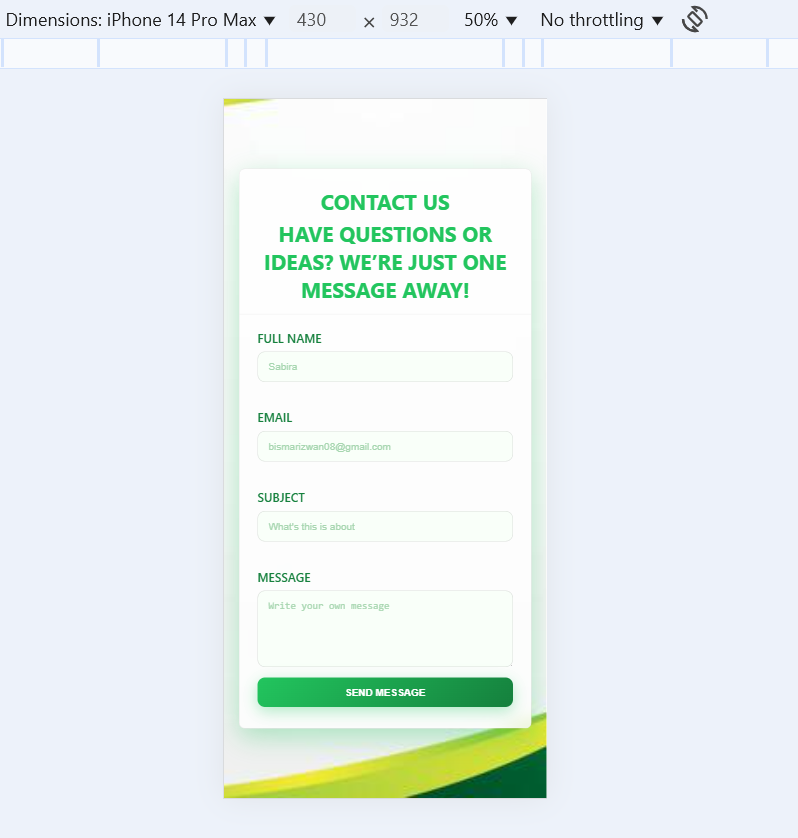
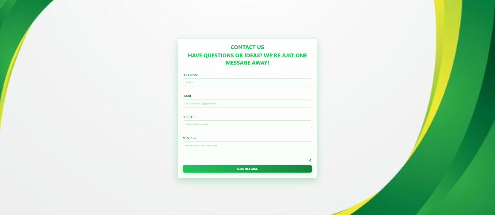

# Contact_Form
A modern, responsive Contact Form built with HTML, CSS, and JavaScript.   It features client-side validation, error handling, and a success message with a smooth UI design.
## Features
• Responsive card-based layout  
• Real-time validation (name, email, subject, message)  
• Inline error messages  
• Success message with auto-hide  
• Styled with modern CSS variables and blur effect
## Technologies Used
- HTML5
- CSS3 
- Vanilla JavaScript
  
  

    
